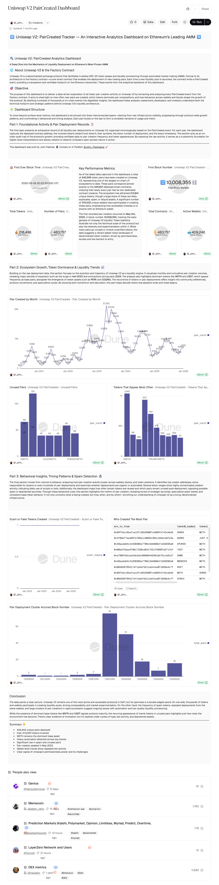

# Uniswap V2: PairCreated Dashboard

An interactive analytics dashboard that provides comprehensive insights into Uniswap V2's liquidity deployment mechanics on Ethereum. This dashboard analyzes every PairCreated event from the Factory contract to shed light on pair creation activity, token distribution patterns, and behavioral trends across the protocol's history.

**Live Dashboard:** [https://dune.com/_john_/uniswap-v2-paircreated-dashboard](https://dune.com/_john_/uniswap-v2-paircreated-dashboard)

---

## Table of Contents

- [Overview](#overview)
- [Dashboard Structure](#dashboard-structure)
- [Key Metrics](#key-metrics)
- [Data Insights](#data-insights)
- [Technical Details](#technical-details)
- [About the Creator](#about-the-creator)

---

## Overview

This dashboard delivers a data-driven exploration of token pair creation activity on Uniswap V2 by extracting and analyzing every PairCreated event from the Factory contract. It aims to help users understand both the technical footprint and strategic patterns behind Uniswap V2's liquidity architecture.

The dashboard is structured into three interconnected layers that build from raw infrastructure visibility to protocol-wide growth patterns and behavioral insights.

### Purpose

- **Audit Trail:** Provide verifiable data on pair creation frequency and token appearances
- **Growth Analysis:** Visualize monthly and cumulative pair creation volumes to identify expansion periods
- **Pattern Detection:** Identify dominant tokens, unusual deployments, and automation signatures
- **Research Tool:** Enable analysts, researchers, developers, and investors to understand Uniswap V2's evolution

---

## Dashboard Structure

The dashboard is organized into three analytical parts:

### Part 1: Foundational Activity & Pair Deployment Records

The first layer presents an exhaustive record of all liquidity pair deployments on Uniswap V2, organized chronologically based on the PairCreated event.

**What it shows:**
- Complete deployment history with contract addresses for each pair
- Token0 and Token1 identifiers and their symbols
- Block numbers and exact timestamps
- Total pair count and active wallet statistics

**Key Metrics:**
- **First Block Time:** May 5th, 2020 at 20:22:25 UTC (Block 10,008,355)
- **Total Tokens:** 218,498 unique tokens deployed
- **Number of Pairs:** 483,757 unique pairs created
- **Total Contracts:** 483,757 factory-deployed contracts
- **Active Wallets:** 409,246 unique addresses that created pairs

This section serves as the foundational audit trail, providing verifiable on-chain data that serves as a trustworthy foundation for higher-level interpretations.

---

### Part 2: Ecosystem Growth, Token Dominance & Liquidity Trends

Building on the raw deployment data, this section analyzes the evolution and trajectory of Uniswap V2 as a liquidity engine.

**Visualizations include:**

#### Pair Created by Month
A time series chart showing monthly pair creation volumes from July 2020 through January 2026, revealing:
- Major expansion periods (mid-2023 surge with 21,322 pairs created)
- Contraction phases during early 2024
- Recent stabilization patterns
- The emergence of newer assets such as PEPE and COGNU

#### Unused Pairs
Analysis of pairs that appear most frequently in deployments but show minimal actual usage, broken down by base asset:
- **WETH:** 192 unused pairs
- **FBTC/pumpBTC:** 52 unused pairs each
- **SHREK/WETH:** 40 unused pairs each
- Other base assets with 44-65 unused pairs

#### Tokens That Appear Most Often
Identifies the most dominant base assets in pair compositions:
- **WETH:** 1,048 appearances (dominant base asset)
- **ETH/WETH:** 937 appearances
- **TEST/WETH:** 704 appearances
- **WETH:** 476 appearances
- Additional appearances ranging from 211-365 for tokens like XWM/ETH

This section highlights just how noisy the environment has become, with evidence of innovation layered atop older cycles of hype, stability, and abandonment. The recurring appearance of meme tokens in unused pairs suggests ongoing speculation and experimentation within the ecosystem.

---

### Part 3: Behavioral Insights, Timing Patterns & Spam Detection

The final section moves from volume to behavior, analyzing how pair creation events cluster across wallets, blocks, and token positions.

**Analysis includes:**

#### Scam or Fake Tokens Created
A timeline showing the volume of suspicious token deployments over time, with minimal activity detected across most periods (Jan 2022 through Jan 2025).

#### Who Created The Most Pair
Identifies the most prolific pair creators by wallet address:
- Top creator: **156 total pairs created**
- Second: **132 pairs created**
- Additional high-volume creators with 47-81 pairs each

This ranking helps identify potential:
- Automated liquidity deployment bots
- Protocol deployers managing multiple pairs
- Potential spam or low-quality token factories

#### Pair Deployment Cluster Across Block Number
Visualization showing how pair creations cluster temporally:
- **Major cluster:** 75 pairs around block 10,061,000
- **Secondary cluster:** 51 pairs around block 10,092,000
- Additional clusters of 7-18 pairs across various block ranges

Large clusters in rapid succession suggest strategic launches, speculative waves, or coordinated bot activity signaling possible spam or abandoned launches.

---

## Key Metrics

### Historical Milestones
- **Genesis:** First pair deployed May 5th, 2020 in block 10,008,355
- **Peak Activity:** May 2023 with 21,322 pairs created in a single month
- **Total Deployment:** 483,757 pairs across 409,246 unique wallet addresses

### Token Distribution
- **Most Common Base:** WETH appears in 1,048+ pair compositions
- **Significant Rise:** Meme tokens (PEPE, COGNU) showing recurrence in unused pairs
- **Diversity:** 218,498 unique tokens deployed, though many see minimal usage

### Behavioral Patterns
- **Heavy Automation:** Wallets deploying 100+ pairs indicate bot activity
- **Strategic Timing:** Block-level clustering reveals coordinated deployment strategies
- **Abandoned Projects:** Significant number of unused pairs highlight speculative nature

---

## Data Insights

### What This Dashboard Reveals

1. **Permissionless Innovation at Scale**
   - Over 400,000 unique addresses participated in creating liquidity pairs
   - Demonstrates the accessible nature of DeFi infrastructure

2. **The Reality of Token Proliferation**
   - While nearly half a million pairs exist, token dominance patterns show WETH remains the primary base asset
   - Most experimentation occurs with long-tail assets that see minimal usage

3. **Automation's Footprint**
   - Clustering patterns and high-volume creators reveal significant bot activity
   - Suggests both legitimate market-making operations and potential spam

4. **Historical Context Matters**
   - The 2023 surge correlates with broader crypto market cycles
   - Recent stabilization may indicate maturation or migration to newer protocols

5. **Quality vs. Quantity**
   - Unused pair analysis highlights the gap between deployment and actual liquidity provision
   - Not all pair creation translates to meaningful protocol usage

---

## Technical Details

### Data Source
- **Blockchain:** Ethereum mainnet
- **Contract:** Uniswap V2 Factory
- **Event:** `PairCreated(address indexed token0, address indexed token1, address pair, uint)`
- **Time Range:** May 2020 - January 2026

### Methodology
- Chronological extraction of all PairCreated events
- Token symbol resolution and address mapping
- Temporal aggregation for monthly trend analysis
- Behavioral pattern detection through wallet and block clustering
- Unused pair identification through activity correlation

### Tools & Platform
- **Platform:** Dune Analytics
- **Query Language:** SQL (Dune SQL)
- **Visualization:** Interactive charts and tables
- **Update Frequency:** Real-time blockchain data

---

## About the Creator

This dashboard was built by **@_john_** ([Twitter/X: @John_TheAnalyst](https://x.com/John_TheAnalyst)).

The goal was to move beyond surface-level metrics and provide a comprehensive view of Uniswap V2's pair deployment mechanics—from raw infrastructure data to behavioral insights that reveal automation patterns and protocol evolution.

---

## Use Cases

This dashboard is valuable for:

- **Researchers:** Understanding DeFi protocol adoption and usage patterns
- **Developers:** Analyzing token deployment strategies and factory contract usage
- **Analysts:** Identifying market trends, bot activity, and liquidity patterns
- **Investors:** Evaluating token ecosystems and market structure
- **Educators:** Teaching about decentralized exchanges and on-chain analytics

---

## Summary

**Key Findings:**

✓ 444,644 unique pairs deployed  
✓ 218,498 unique tokens participating  
✓ WETH remains the dominant base asset  
✓ Heavy automation detected across key blocks  
✓ Significant rise in spam and unused pairs  
✓ Pair creation peaked in May 2023  
✓ Wallet-level trends show repeated bot activity  
✓ Clear signs of Uniswap V2's permissionless power and its challenges

---

## Conclusion

The data paints a picture of Uniswap V2 as one of the most active and accessible protocols in DeFi. While thousands of tokens and wallets participate in creating liquidity pools, the frequency of spam tokens, repeated deployments from the same wallets, and large clusters of pair creations in rapid succession suggest ongoing issues with automation and low-quality liquidity provisioning.

That said, the recurring appearance of major base assets like WETH and the wallet-level trends show resilience too—there's clear evidence of innovation, but it's layered over older cycles of hype, stability, and abandonment.

This dashboard aims to shed light on these dynamics, helping the community separate signal from noise in Uniswap V2's permissionless ecosystem.

---

## License

This dashboard and its queries are open-source and available for use, modification, and distribution.

## Feedback & Contributions

Questions, suggestions, or feedback? Reach out via:
- **Twitter:** [@John_TheAnalyst](https://x.com/John_TheAnalyst)
- **Dune:** [@_john_](https://dune.com/_john_)

---

*Last Updated: January 2026*
